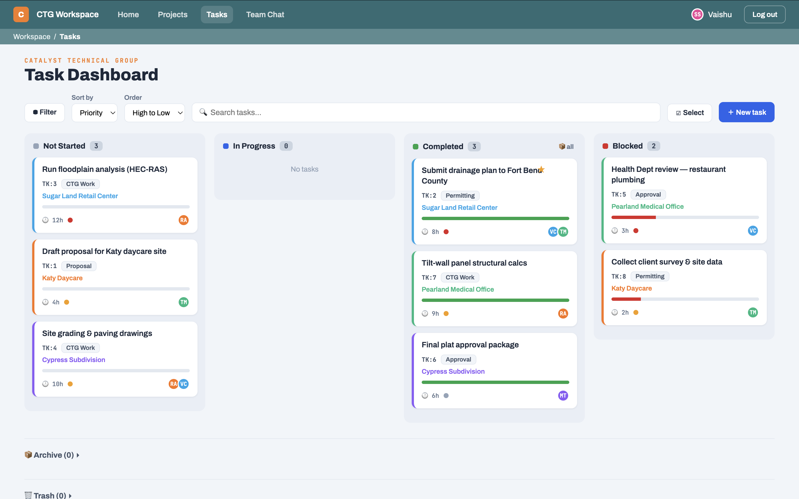
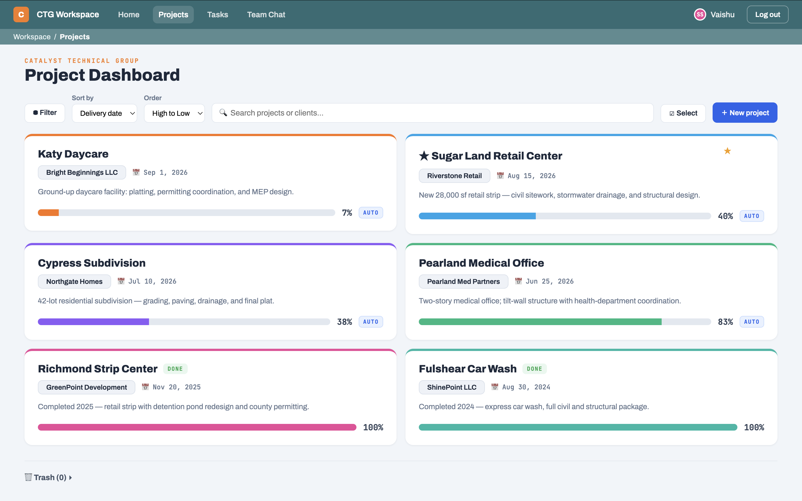
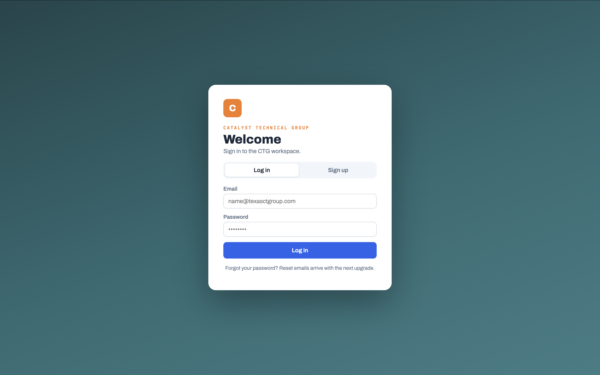
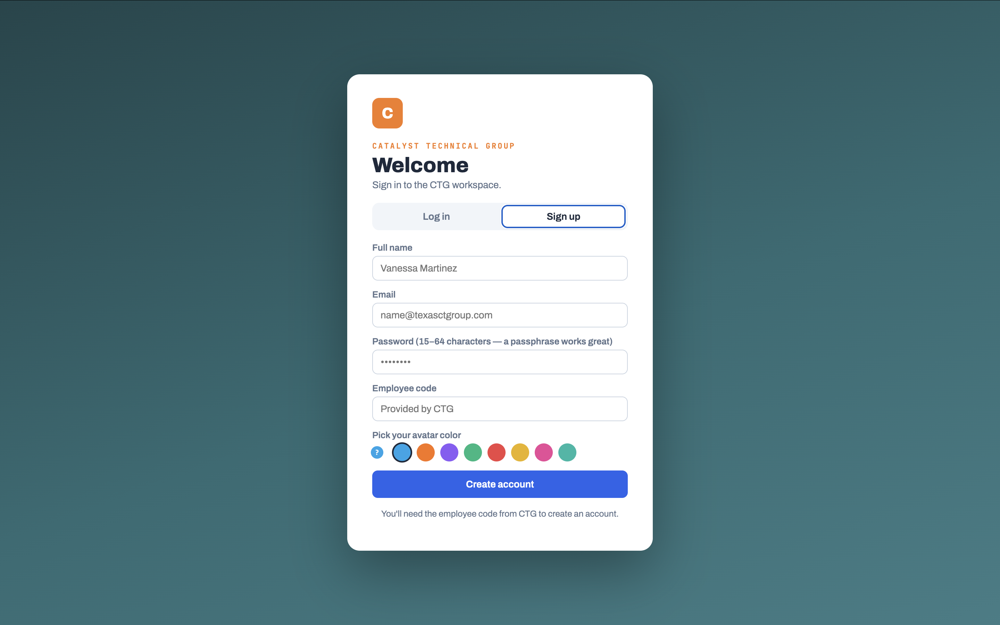

# CTG Workspace

**A live task-and-project dashboard I built for a real civil engineering firm during my summer internship, so the team could stop tracking hundreds of projects by walking around and asking each other out loud.**

Built for [Catalyst Technical Group](https://texasctgroup.com), a Houston-based civil engineering consulting firm, where I interned in the summer of 2026.

**Live app:** [ctg-dashboard.vercel.app](https://ctg-dashboard.vercel.app) (sign-up is restricted to CTG staff, so the screenshots below show it in action)

---

## The problem

Catalyst Technical Group runs a lot of projects at once, and the team mostly kept track of tasks by talking to each other in person. That made it hard to stay up to date on who was working on what and how far along things were. I wanted to build a simple shared place where the team could see and update everything in one spot.

## The solution

**CTG Workspace** is a web app the whole team logs into to see every project and task in one place: updated live, shared across everyone's screens.

Instead of walking to someone's desk:
- You open the **board** and instantly see every task, who it's assigned to, what discipline it falls under, and whether it's on schedule.
- You drag a task from "In Progress" to "Completed" and **everyone else's screen updates in real time**: no refresh, no email, no asking.
- You open a **project page** to see its team, milestones, timeline, open decisions, and a running feed of updates and roadblocks, then generate a one-click **status report** to send a client.

**Impact:** The five-member engineering firm uses the tool to manage projects, keep up with tasks, and generate reports, instead of tracking everything verbally.

## What it looks like

### The task board
The heart of the app: every task as a card, color-coded by project, draggable between columns.



### A project page
Each project rolls up its tasks, with progress auto-calculated from the hours-weighted average of its tasks.



### Secure sign-in and sign-up
Accounts are restricted to company email addresses and require an employee code, so only CTG staff can get in. New employees sign up with their company email, a passphrase-friendly password, the employee code, and a pick of avatar color.





### The project page and status report, the part I'm most proud of
Each project has an **Overview** with its team, an editable **milestone timeline**, a **Decisions Needed** table, and chat-style **Updates** and **Roadblocks** feeds. From there, one click generates a **status report**, auto-summarized from the project's own data (task counts, next milestone, open decisions), that exports to **PDF or Word** to send a client.


## Features

- **Real authentication:** cloud accounts with securely hashed passwords, email confirmation, and sign-up locked to the company email domain plus an employee code
- **Live realtime sync:** task, project, chat, milestone, and note changes appear on every logged-in screen automatically
- **Kanban task board:** drag-and-drop across Not Started / In Progress / Completed / Blocked, with priority, assignees, due dates, and an on-track / behind / past-due indicator
- **Task disciplines:** every task is typed (Architectural, Civil, Structural, MEP, Permitting, Admin), and each project's board groups tasks into those discipline columns
- **Project pages** with an Overview / Tasks / Report split: a project manager and assignees, an editable **milestone list and visual timeline**, a **Decisions Needed** table, and chat-style **Updates** and **Roadblocks** feeds
- **One-click status report:** auto-summarized from the project's own data (task counts, next milestone, open decisions), exportable to **PDF or Word**
- **Auto-calculated progress:** project progress is the hours-weighted average of its tasks, with a manual override
- **Bulk actions:** select-all and multi-select on the board and project grid, plus select/recover/delete in Trash and bulk actions in the Archive
- **Team chat and per-project feeds** with per-message ownership (you can only edit or delete your own posts, enforced by the database)
- **Quality-of-life:** the app remembers the screen you were on, saves a half-finished task if you close the form, and shows a breadcrumb of where you are
- **Trash and recovery** for both tasks and projects, so nothing is lost to a misclick
- **Profiles:** custom avatar colors, nicknames, and password changes

## Built with

- **React + Vite:** the frontend
- **Supabase** (PostgreSQL, Auth, Row Level Security, Realtime): the cloud backend
- **GitHub:** version control

## What I learned

I taught myself a lot building this over the summer, one piece at a time:

- How to design a **database** and write SQL to create tables and relationships
- How **authentication** actually works: why passwords are hashed, and why a public API key can be safe when **Row Level Security** guards the data behind it
- How to move an app from browser-only storage to a real **cloud backend** without breaking the interface
- How **realtime** subscriptions keep multiple users in sync
- Some professional habits: keeping secrets out of the repo, writing readable code, and committing my work in small steps (you can see the whole build in the commit history)

## Running it locally

> Note: the app connects to a private Supabase backend, so running it yourself requires your own free Supabase project and keys. The code and structure are what's on display here.

```bash
npm install
npm run dev
```

Then create a `.env.local` file with your own Supabase project URL and anon key:

```
VITE_SUPABASE_URL=your-project-url
VITE_SUPABASE_ANON_KEY=your-anon-key
```

---

*Built by Vaishu, a high school student, during a summer internship at Catalyst Technical Group, 2026.*
