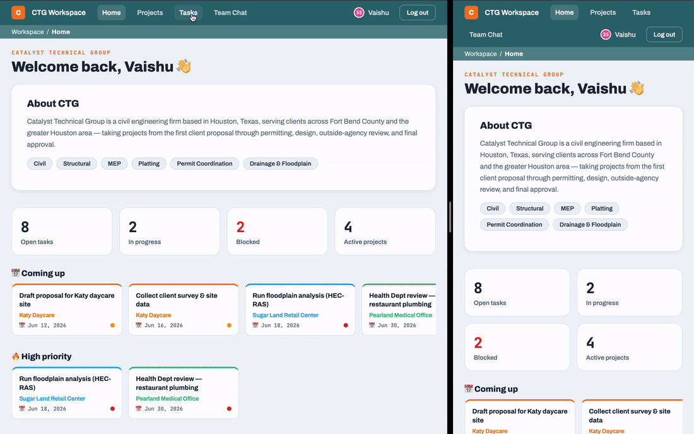

# CTG Workspace

**A live task-and-project dashboard I built for a real civil engineering firm during my summer internship, so the team could stop tracking hundreds of projects by walking around and asking each other out loud.**

Built for [Catalyst Technical Group](https://texasctgroup.com), a Houston-based civil engineering consulting firm, where I interned in the summer of 2026.

---

## The problem

Catalyst Technical Group runs hundreds of active engineering projects (drainage plans, site grading, permitting, structural calcs), all stored as nested folders of PDFs organized by year. But there was no system tracking *who was doing what, and how far along it was.*

The whole team coordinated **verbally.** To find out the status of a task, you walked over to a coworker's desk and asked. To hand something off, you told them in person and hoped they remembered. With four engineers juggling dozens of projects each, work fell through the cracks, the same questions got asked over and over, and nobody had a single view of everything in flight.

There was no shared source of truth. I set out to build one.

## The solution

**CTG Workspace** is a web app the whole team logs into to see every project and task in one place: updated live, shared across everyone's screens.

Instead of walking to someone's desk:
- You open the **board** and instantly see every task, who it's assigned to, what stage it's in, and whether it's on schedule.
- You drag a task from "In Progress" to "Completed" and **everyone else's screen updates in real time**: no refresh, no email, no asking.
- You leave a comment on a task or post in **team chat**, and it's there for the whole team.

> **Impact:** _[Optional: drop a real number or quote here once the team has used it for a few weeks. Example: "The team now checks the board instead of interrupting each other," or a one-line quote from my supervisor.]_

## What it looks like

### The task board
The heart of the app: every task as a card, color-coded by project, draggable between columns.


### A project page
Each project rolls up its tasks, with progress auto-calculated from the hours-weighted average of its tasks.


### Secure sign-in
Accounts are restricted to company email addresses and require an employee code, so only CTG staff can get in.


### Sign-up
New employees sign up with their company email, a passphrase-friendly password, the employee code, and a pick of avatar color.


### Live sync, the part I'm most proud of
Two windows, side by side. A change in one appears in the other instantly. This is what makes it a real team tool instead of a personal to-do list.



## Features

- **Real authentication:** cloud accounts with securely hashed passwords, email confirmation, and sign-up locked to the company email domain plus an employee code
- **Live realtime sync:** task, project, and chat changes appear on every logged-in screen automatically
- **Kanban task board:** drag-and-drop across Not Started / In Progress / Completed / Blocked, with priority, assignees, due dates, and an on-track / behind / past-due indicator
- **Projects:** grouped tasks with auto-calculated progress (hours-weighted), plus a manual override
- **Team chat** with per-message ownership (you can only edit or delete your own messages)
- **Per-task comment threads** for updates and handoffs
- **Trash and recovery** for both tasks and projects, so nothing is lost to a misclick
- **Profiles:** custom avatar colors, nicknames, and password changes

## Built with

- **React + Vite:** the frontend
- **Supabase** (PostgreSQL, Auth, Row Level Security, Realtime): the cloud backend
- **GitHub:** version control

## What I learned

I started this project as a beginner coder. Over the summer I taught myself, one piece at a time:

- How to design a **database** and write SQL to create tables and relationships
- How **authentication** actually works: why passwords are hashed, and why a public API key can be safe when **Row Level Security** guards the data behind it
- How to move an app from browser-only storage to a real **cloud backend** without breaking the interface
- How **realtime** subscriptions keep multiple users in sync
- The professional habits: never committing secrets, writing readable code, and committing my work incrementally (you can see the whole build in the commit history)

The hardest part wasn't any single feature; it was debugging the things that failed silently, and learning to read error messages instead of fearing them.

## Running it locally

> Note: the app connects to a private Supabase backend, so running it yourself requires your own free Supabase project and keys. The code and structure are what's on display here.

```bash
npm install
npm run dev
```

Then create a `.env.local` file with your own Supabase project URL and anon key:

```
VITE_SUPABASE_URL=your-project-url
VITE_SUPABASE_ANON_KEY=your-anon-key
```

---

*Built by Vaishu, a high school student, during a summer internship at Catalyst Technical Group, 2026.*
